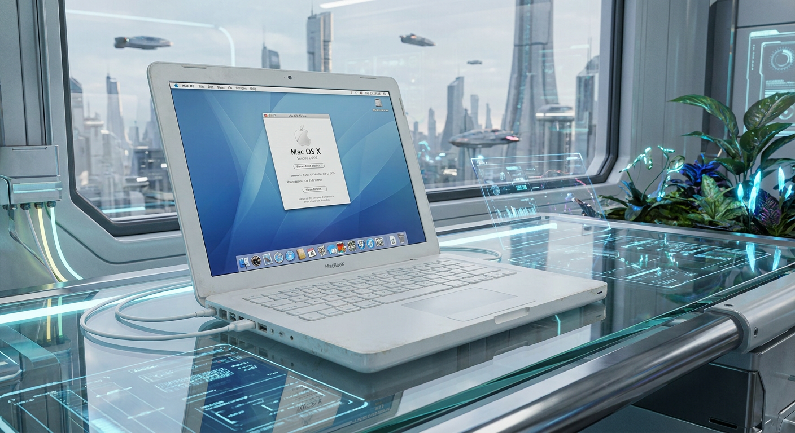
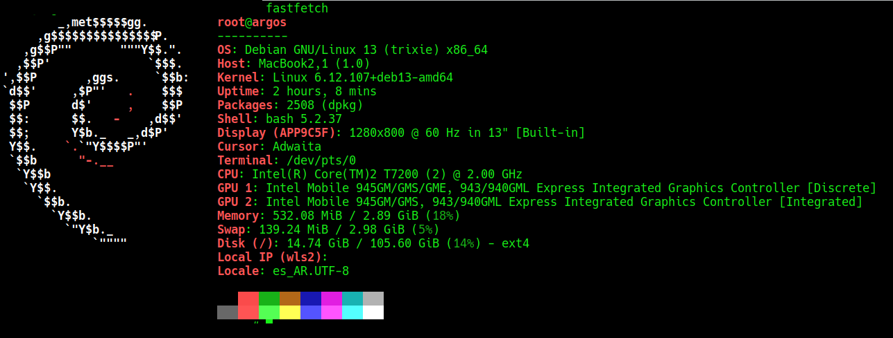

<div align="center">
  
</div>

<p align="center">
  <strong>Español</strong> · <a href="README.md">English</a>
</p>

---

# Debian 64 bits en MacBook2,1 con EFI de 32 bits usando Ventoy

Guía práctica para instalar **Debian GNU/Linux de 64 bits (`amd64`)** en una **Apple MacBook2,1** de 2006/2007, equipada con un procesador Intel Core 2 Duo de 64 bits pero con firmware **EFI de 32 bits**.

El procedimiento utiliza **Ventoy** para crear un pendrive capaz de arrancar en modo **IA32 UEFI** y cargar la imagen normal de Debian `amd64`. Además documenta las correcciones posteriores a la instalación que necesita este equipo: el **arranque intermitente con pantalla negra** y el **loop en el login con LXQt + SDDM**.

> [!IMPORTANT]
> Esta guía está basada en una instalación realizada y probada sobre una **MacBook2,1**. Ventoy considera experimental su soporte IA32 UEFI, por lo que el comportamiento puede variar en otros equipos Apple antiguos.

---

## Contenido

- [El problema](#el-problema)
- [Hardware probado](#hardware-probado)
- [Qué se necesita](#qué-se-necesita)
- [Método 1: preparar el pendrive desde Linux](#método-1-preparar-el-pendrive-desde-linux)
- [Método 2: preparar el pendrive desde Windows](#método-2-preparar-el-pendrive-desde-windows)
- [Arrancar la MacBook2,1](#arrancar-la-macbook21)
- [Instalación de Debian](#instalación-de-debian)
- [Solución al arranque intermitente con pantalla negra](#solución-al-arranque-intermitente-con-pantalla-negra)
- [Entorno de escritorio](#entorno-de-escritorio)
  - [Opción A: Xfce](#opción-a-xfce)
  - [Opción B: LXQt con SDDM](#opción-b-lxqt-con-sddm)
- [Verificar que Debian quedó instalado en 64 bits](#verificar-que-debian-quedó-instalado-en-64-bits)
- [Solución de problemas](#solución-de-problemas)
- [Por qué funciona](#por-qué-funciona)
- [Referencias](#referencias)
- [Resultado](#resultado)

---

## El problema

La MacBook2,1 tiene una combinación poco habitual:

| Componente | Arquitectura |
|---|---|
| Procesador Intel Core 2 Duo | 64 bits |
| Sistema operativo que puede ejecutar | 64 bits (`amd64`) |
| Firmware EFI de la Mac | 32 bits (`IA32`) |

Por este motivo, un pendrive preparado de la forma habitual puede no aparecer en el administrador de arranque de la Mac o puede fallar antes de iniciar el instalador.

Ventoy incorpora soporte para **IA32 UEFI** y permite utilizar una ISO Debian `amd64` sin tener que construir manualmente un cargador GRUB EFI de 32 bits.

---

## Hardware probado

| Elemento | Valor |
|---|---|
| Equipo | Apple MacBook2,1 (2006) |
| CPU | Intel Core 2 Duo T7200 @ 2.00 GHz (x86-64) |
| GPU | Intel GMA 950 (945GM) |
| Firmware | EFI 1.1 de Apple, 32 bits (IA32) |
| Sistema | Debian 13 (trixie) `amd64`, kernel 6.12 |
| Cargador de arranque | `grub-efi-ia32` |
| Medio de instalación | Pendrive USB 2.0 con Ventoy |
| Escritorios probados | Xfce (funciona sin cambios) y LXQt + SDDM (funciona tras las correcciones de esta guía) |

Sistema resultante, según `fastfetch`:

<div align="center">
  
</div>

> [!NOTE]
> `fastfetch` muestra la GMA 950 dos veces ("Discrete" e "Integrated"). Es normal: el 945GM expone dos funciones PCI para el mismo chip. Hay una sola GPU.

---

## Qué se necesita

1. Una MacBook2,1.
2. Un pendrive USB. Se recomienda **USB 2.0** para estos equipos antiguos.
3. Otra computadora con:
   - Linux, o
   - Windows.
4. Ventoy.
5. Una imagen oficial de Debian para arquitectura `amd64`.
6. Recomendado: otra computadora en la misma red para acceder a la MacBook por **SSH** durante los pasos posteriores a la instalación.

### Descargas

- Ventoy: https://www.ventoy.net/en/download.html
- Debian: https://www.debian.org/download

Para una instalación por red se puede utilizar la imagen:

```text
debian-13.x.x-amd64-netinst.iso
```

La versión exacta cambiará con las nuevas publicaciones de Debian.

> [!NOTE]
> Para este procedimiento se recomienda la ISO normal **`amd64`**. No es necesario utilizar la imagen `debian-mac-...-amd64-netinst.iso`.

---

## Método 1: preparar el pendrive desde Linux

### 1. Descargar Ventoy

Descargar la versión de Ventoy para Linux y descomprimirla.

Por ejemplo:

```bash
tar -xzf ventoy-x.x.xx-linux.tar.gz
cd ventoy-x.x.xx
```

### 2. Identificar el pendrive

Conectar el pendrive y ejecutar:

```bash
lsblk -d -e 7,11 -o NAME,SIZE,MODEL,TRAN
```

Ejemplo:

```text
NAME   SIZE MODEL             TRAN
sda    477G SSD
sdb   14.9G USB Flash Drive   usb
```

En este ejemplo el pendrive es:

```text
/dev/sdb
```

> [!CAUTION]
> Verificar cuidadosamente cuál es el dispositivo USB. Elegir el disco equivocado puede destruir los datos de otro disco.

### 3. Instalar Ventoy en el pendrive

Desde el directorio donde se descomprimió Ventoy:

```bash
sudo ./Ventoy2Disk.sh -i /dev/sdX
```

Reemplazar `/dev/sdX` por el dispositivo correspondiente.

Ejemplo:

```bash
sudo ./Ventoy2Disk.sh -i /dev/sdb
```

Ventoy solicitará confirmación antes de modificar el pendrive.

> [!WARNING]
> La instalación normal de Ventoy formatea el dispositivo y elimina su contenido.

El comando anterior utiliza el esquema de particiones **MBR**, que es el predeterminado de Ventoy y es el utilizado en este procedimiento.

### 4. Copiar la ISO de Debian

Una vez instalado Ventoy, desconectar y volver a conectar el pendrive si fuera necesario.

Aparecerá una partición llamada normalmente `Ventoy`. Copiar directamente dentro de ella la ISO de Debian:

```text
debian-13.x.x-amd64-netinst.iso
```

No hay que extraer la ISO ni grabarla con `dd`. Ventoy se encargará de detectar el archivo ISO y mostrarlo en su menú de arranque.

---

## Método 2: preparar el pendrive desde Windows

Este método es más sencillo porque Ventoy dispone de una interfaz gráfica.

### 1. Descargar Ventoy para Windows

Descargar el archivo `ventoy-x.x.xx-windows.zip` y descomprimirlo en una carpeta.

### 2. Ejecutar Ventoy

Dentro de la carpeta ejecutar `Ventoy2Disk.exe`. Es recomendable abrirlo con **Ejecutar como administrador**.

### 3. Seleccionar el pendrive

En **Device**, elegir cuidadosamente el pendrive USB que se utilizará para instalar Debian.

Mantener el esquema de particiones en **MBR** y pulsar **Install**.

Ventoy mostrará advertencias indicando que se borrará el contenido del pendrive. Confirmar únicamente después de verificar que se seleccionó el dispositivo correcto.

### 4. Copiar Debian al pendrive

Cuando Ventoy termine, Windows mostrará una nueva unidad llamada normalmente `Ventoy`. Abrirla desde el Explorador de archivos y copiar dentro la ISO:

```text
debian-13.x.x-amd64-netinst.iso
```

Eso es todo. No hace falta utilizar Rufus, `dd`, Etcher ni extraer el contenido de la ISO.

---

## Arrancar la MacBook2,1

### 1. Conectar el pendrive

Con la MacBook apagada, conectar el pendrive Ventoy.

### 2. Abrir el administrador de arranque

Encender la Mac e inmediatamente mantener presionada la tecla **Option / Alt (⌥)** hasta que aparezca el administrador de arranque de Apple.

Debería aparecer el dispositivo USB como una opción de arranque. Seleccionarlo y presionar **Enter**.

### 3. Comprobar que Ventoy inició en IA32

Cuando aparezca el menú de Ventoy, mirar la información que se muestra en la parte inferior de la pantalla. En esta Mac el modo esperado es:

```text
IA32
```

Esto significa que Ventoy ha sido arrancado mediante el firmware EFI de 32 bits de la MacBook.

### 4. Seleccionar Debian

En el menú de Ventoy seleccionar `debian-13.x.x-amd64-netinst.iso`, presionar **Enter** y continuar con el instalador de Debian.

Aunque el firmware EFI sea de 32 bits, el sistema Debian que se instalará será de **64 bits (`amd64`)**, porque el procesador Core 2 Duo de la MacBook2,1 soporta x86-64.

---

## Instalación de Debian

Una vez iniciado el instalador, el procedimiento es prácticamente el mismo que en cualquier PC:

1. Seleccionar idioma.
2. Configurar teclado.
3. Configurar red.
4. Crear usuario y contraseña.
5. Particionar el disco según el tipo de instalación deseada.
6. Instalar el sistema base.
7. Instalar GRUB cuando lo solicite Debian.
8. En **tasksel**, seleccionar el entorno de escritorio (ver [Entorno de escritorio](#entorno-de-escritorio)), **Servidor SSH** y **utilidades estándar del sistema**.

Esta guía se concentra en resolver el problema particular de **arrancar un instalador Debian de 64 bits desde una EFI de 32 bits**. El particionado dependerá de si Debian reemplazará completamente a macOS o se instalará junto a otro sistema.

> [!TIP]
> Se recomienda especialmente instalar el **Servidor SSH**. Si falla la sesión gráfica, se puede diagnosticar y corregir todo desde otra computadora.

---

## Solución al arranque intermitente con pantalla negra

### Síntoma

Después de elegir el kernel en GRUB, la pantalla queda negra y el equipo no avanza. La falla es **intermitente**: el mismo kernel a veces arranca y a veces no, y afecta a todos los kernels instalados.

El arranque fallido **no deja ninguna línea en el journal persistente**: el cuelgue ocurre muy temprano, antes de montar la raíz.

### Causa

Las llamadas del kernel a los **servicios de runtime** del firmware EFI de Apple (32 bits, modo mixto) se cuelgan de forma aleatoria durante el arranque. Desactivar esos servicios con el parámetro del kernel `efi=noruntime` elimina la falla.

**Verificación:** 9 arranques en frío seguidos sin fallas, alternando dos kernels. Antes fallaba aproximadamente uno de cada dos.

### Paso 1. Si no arranca justo después de instalar (temporal)

Este cambio vale solo para ese arranque y no modifica nada en el disco. Sirve para poder entrar al sistema y hacer el cambio permanente del Paso 2.

1. En el menú de GRUB, posicionarse con las flechas sobre **Debian GNU/Linux** (o sobre un kernel dentro de "Opciones avanzadas").
2. Presionar la tecla **`e`**. Se abre un editor con los comandos de arranque de esa entrada.
3. Bajar con las flechas hasta la línea que empieza con la palabra **`linux`** (no confundir con la línea `echo` que dice "Cargando Linux…").
4. Ir al final de esa línea. La MacBook no tiene tecla **Fin**: usar **Ctrl+E** (en GRUB lleva el cursor al final de la línea). Si la línea es larga puede verse partida en dos renglones, pero sigue siendo una sola línea.
5. Escribir un espacio y después `efi=noruntime`.
6. Presionar **Ctrl+X** (o **F10**) para arrancar con ese cambio. Con **Esc** se sale sin arrancar y se descarta la edición.

Editor **antes** de editar (el UUID y la versión del kernel varían en cada instalación):

```text
setparams 'Debian GNU/Linux'
        load_video
        insmod gzio
        insmod part_gpt
        insmod ext2
        search --no-floppy --fs-uuid --set=root 244b083d-dbb8-4b17-...
        echo    'Cargando Linux 6.12.107+deb13-amd64 ...'
        linux   /boot/vmlinuz-6.12.107+deb13-amd64 root=UUID=244b083d-dbb8-4b17-ba8b-27faa4a0025a ro quiet
        echo    'Cargando imagen de memoria inicial ...'
        initrd  /boot/initrd.img-6.12.107+deb13-amd64
```

**Después** de editar, la única diferencia es el final de la línea `linux`:

```text
        linux   /boot/vmlinuz-6.12.107+deb13-amd64 root=UUID=244b083d-dbb8-4b17-ba8b-27faa4a0025a ro quiet efi=noruntime
```

No se borra ni se modifica nada más.

> [!NOTE]
> Si el arranque igual queda en negro, apagar forzado (mantener 10 segundos el botón de encendido) y repetir. La falla original era intermitente, así que un solo intento fallido no descarta la solución.

### Paso 2. Hacer permanente el parámetro

Una vez dentro del sistema, se agrega el parámetro a `/etc/default/grub`. A partir de ese archivo `update-grub` genera las entradas del menú, así que el parámetro queda en todos los kernels, incluidos los que se instalen en el futuro.

Línea a modificar, **antes** (valor por defecto de Debian):

```text
GRUB_CMDLINE_LINUX_DEFAULT="quiet"
```

**Después**:

```text
GRUB_CMDLINE_LINUX_DEFAULT="quiet efi=noruntime"
```

**Opción A**, con un comando (como root, con `su -`). Reemplaza la línea completa, sea cual sea su contenido previo:

```bash
sed -i 's/^GRUB_CMDLINE_LINUX_DEFAULT=.*/GRUB_CMDLINE_LINUX_DEFAULT="quiet efi=noruntime"/' /etc/default/grub
```

**Opción B**, a mano: `nano /etc/default/grub`, editar la línea, guardar con **Ctrl+O** y **Enter**, y salir con **Ctrl+X**.

En cualquiera de los dos casos, confirmar y regenerar el menú:

```bash
grep CMDLINE /etc/default/grub
update-grub
```

El `grep` debe mostrar exactamente esto:

```text
GRUB_CMDLINE_LINUX_DEFAULT="quiet efi=noruntime"
GRUB_CMDLINE_LINUX=""
```

Sobre los valores de la línea: `quiet` oculta los mensajes del kernel durante el arranque; para verlos (útil al diagnosticar), dejar solo `"efi=noruntime"`. También se puede agregar `splash` para la pantalla gráfica de arranque. Lo único obligatorio es que **`efi=noruntime` esté siempre presente**.

Después del siguiente reinicio, `cat /proc/cmdline` debe mostrar algo como:

```text
BOOT_IMAGE=/boot/vmlinuz-6.12.107+deb13-amd64 root=UUID=244b083d-... ro quiet efi=noruntime
```

Además, al presionar `e` en GRUB, la línea `linux` ya aparece con `efi=noruntime` al final.

### Paso 3. Proteger las futuras actualizaciones de GRUB

Con `efi=noruntime`, Linux no puede escribir en la NVRAM. Se configura GRUB para que no lo intente y para que se copie en la ruta de respaldo que la Mac siempre revisa:

```bash
echo "grub-efi-ia32 grub2/update_nvram boolean false" | debconf-set-selections
echo "grub-efi-ia32 grub2/force_efi_extra_removable boolean true" | debconf-set-selections
dpkg-reconfigure -f noninteractive grub-efi-ia32
```

### Paso 4. Verificar

```bash
cat /proc/cmdline                    # debe incluir efi=noruntime
ls /boot/efi/EFI/BOOT/               # debe aparecer BOOTIA32.EFI
grep GRUB_DEFAULT /etc/default/grub  # debe ser 0 (kernel más nuevo)
apt-mark showhold                    # no debería haber kernels retenidos
```

### Paso 5 (opcional). Journal persistente

En Debian 13 ya viene activado. Si no lo estuviera:

```bash
mkdir -p /var/log/journal
systemd-tmpfiles --create --prefix /var/log/journal
systemctl restart systemd-journald
```

### Qué se pierde con `efi=noruntime`

- No se puede usar `efibootmgr` desde Linux. Si hace falta, arrancar una vez sin el parámetro editando la entrada en GRUB con `e`.
- `pstore` (registros de crash guardados en la NVRAM) deja de funcionar. El journal persistente cubre ese rol.

### Hipótesis descartadas

| Hipótesis | Por qué se descartó |
|---|---|
| Falta de espacio en `/boot` | `/boot` está en la raíz con 87 GB libres |
| Initrd dañado | La falla era intermitente; un initrd roto fallaría siempre |
| Módulos DKMS | `dkms status` sin resultados |
| Microcódigo Intel | El kernel 6.12.94 no lo carga y fallaba igual |
| Regresión del kernel 6.12.107 | El 6.12.94 también fallaba |
| NVRAM llena | Solo 15 variables EFI y pstore vacío |

---

## Entorno de escritorio

En este hardware se probaron dos escritorios:

| Escritorio | Resultado |
|---|---|
| **Xfce** | Funciona correctamente sin configuración adicional. Recomendado para una instalación rápida. |
| **LXQt + SDDM** | Loop en el login con la instalación por defecto. Funciona después de aplicar las correcciones siguientes. |

### Opción A: Xfce

Durante la selección de software de Debian (tasksel), elegir **Xfce**. Es relativamente liviano y funcionó correctamente sin cambios adicionales.

### Opción B: LXQt con SDDM

Instalación desde cero que evita el loop en el login.

| Elemento | Valor |
|---|---|
| Escritorio | LXQt con gestor de ventanas **xfwm4** |
| Gestor de login | SDDM |
| Driver de video | `modesetting` sin aceleración |

#### Síntoma

Después de ingresar usuario y contraseña en SDDM, la pantalla vuelve al login (loop). Con Xfce no ocurría.

#### Causa

El servidor X (Xorg) se caía con **Segmentation fault** en `pci_device_vgaarb_set_target` (libpciaccess) unos 2 segundos después de iniciar la sesión. Lo disparaba **xscreensaver**, que LXQt instala como paquete recomendado. Además, con el driver `modesetting` la aceleración **glamor** impide que X arranque en la GMA 950.

> [!NOTE]
> Los mensajes de Qt sobre `libxcb-cursor0` que aparecen en `~/.xsession-errors` son engañosos: se ven porque X ya murió. No son la causa.

#### 1. Instalación base

- Instalar Debian 13 normalmente.
- En **tasksel** marcar **LXQt**, **Servidor SSH** y **utilidades estándar del sistema**.
- Si el instalador pregunta por el gestor de sesiones, elegir **sddm**.
- Al terminar, **NO iniciar sesión gráfica todavía**. Hacer los pasos siguientes por SSH desde otra PC o desde una consola de texto (**Ctrl + Alt + Fn + F3**).

> [!IMPORTANT]
> Los pasos 2 a 6 se hacen como root (`su -`), **salvo el paso 4**, que se hace con el usuario normal.

#### 2. Quitar y bloquear xscreensaver (causa principal)

Eliminarlo:

```bash
apt purge xscreensaver xscreensaver-data
apt autoremove
dpkg -l | grep -i xscreensaver   # sin líneas "ii"
```

Bloquearlo para que ningún `apt install` futuro lo vuelva a instalar:

```bash
cat > /etc/apt/preferences.d/no-xscreensaver << 'EOF'
Package: xscreensaver*
Pin: release *
Pin-Priority: -1
EOF
```

#### 3. Driver de video: modesetting sin aceleración

Quitar el driver intel antiguo:

```bash
apt purge xserver-xorg-video-intel
```

Crear la configuración que desactiva glamor (sin esto X no arranca):

```bash
mkdir -p /etc/X11/xorg.conf.d
cat > /etc/X11/xorg.conf.d/20-modesetting.conf << 'EOF'
Section "Device"
    Identifier "GMA950"
    Driver     "modesetting"
    Option     "AccelMethod" "none"
EndSection
EOF
```

#### 4. xfwm4 como gestor de ventanas, sin compositor

> [!WARNING]
> Este paso se hace con **tu usuario normal, NO como root**, para no romper permisos del home. Si estás como root, escribí `exit` primero.

Asegurar que xfwm4 esté instalado (como root):

```bash
which xfwm4 || apt install xfwm4
```

Indicarle a LXQt que use xfwm4 (como usuario):

```bash
mkdir -p ~/.config/lxqt
if [ -f ~/.config/lxqt/session.conf ]; then
  sed -i 's/^window_manager=.*/window_manager=xfwm4/' ~/.config/lxqt/session.conf
else
  printf '[General]\nwindow_manager=xfwm4\n' > ~/.config/lxqt/session.conf
fi
```

Desactivar el compositor de xfwm4 (como usuario):

```bash
F="$HOME/.config/xfce4/xfconf/xfce-perchannel-xml/xfwm4.xml"
mkdir -p "$(dirname "$F")"
cat > "$F" << 'EOF'
<?xml version="1.0" encoding="UTF-8"?>
<channel name="xfwm4" version="1.0">
  <property name="general" type="empty">
    <property name="use_compositing" type="bool" value="false"/>
  </property>
</channel>
EOF
cat "$F"     # verificar que muestre el XML
```

> [!NOTE]
> Escribí `F="$HOME/..."` en una sola línea. No uses `su - usuario` seguido de comandos pegados: `su` se queda esperando la contraseña y se come la línea siguiente.

#### 5. Locale en UTF-8

Evita advertencias de Qt y deja el escritorio en español (como root). Marcar `es_AR.UTF-8` (o el que corresponda) y elegirlo como predeterminado:

```bash
dpkg-reconfigure locales
```

#### 6. Confirmar SDDM y reiniciar

```bash
dpkg-reconfigure sddm     # si pregunta, elegir sddm
reboot
```

En el login de SDDM, elegir la sesión **LXQt** e ingresar. Si la pantalla gráfica no aparece sola, probar **Ctrl + Alt + Fn + F2** (o F1/F7).

#### 7. Verificación

```bash
# Debe usar modesetting, sin glamor:
grep -E 'modeset\(0\)|AccelMethod|glamor' /var/log/Xorg.0.log | head

# No debe mostrar nada instalado:
dpkg -l | grep -E 'xscreensaver|light-locker|lightdm'

# Debe decir /usr/bin/sddm:
cat /etc/X11/default-display-manager
```

#### Qué NO hacer

| Evitar | Motivo |
|---|---|
| Instalar xscreensaver | Provoca el crash de Xorg en vgaarb y el loop del login. |
| Instalar light-locker | Depende de LightDM: lo instala y pide cambiar el gestor de login. Con SDDM no funciona. |
| Usar glamor / quitar el `20-modesetting.conf` | Con modesetting y aceleración glamor, X no arranca en la GMA 950. |
| Activar el compositor de xfwm4 | Innecesario en esta GPU; se dejó apagado por estabilidad. |

> [!TIP]
> **Bloqueo de pantalla:** si hace falta, probar `xsecurelock` o `slock` (paquete `suckless-tools`) con un atajo de teclado. Probarlos con cuidado: si tocan DPMS o gamma podrían disparar el mismo bug.

#### Si vuelve el loop: diagnóstico

Hacer un intento de login y después, por SSH como root:

```bash
date
journalctl -b -u sddm --no-pager | tail -40
grep -E '\(EE\)|Fatal|Segmentation|vgaarb' -A12 /var/log/Xorg.0.log.old
tail -40 /home/USUARIO/.xsession-errors
```

| Qué aparece | Qué significa / qué hacer |
|---|---|
| Segmentation fault en `pci_device_vgaarb_set_target` | X se cae por un programa de la sesión. Revisar que xscreensaver no esté instalado (paso 2). |
| `Failed to read display number from pipe` | X no llega a arrancar. Revisar el `20-modesetting.conf` (paso 3). |
| Errores de Qt con `libxcb-cursor0` | Consecuencia de que X murió, no la causa. Mirar `Xorg.0.log.old`. |
| Pantalla de texto tras el boot, pero SSH funciona | El sistema está bien; solo falla la parte gráfica. Diagnosticar por SSH. |

**Plan B:** si nada funciona, LightDM también anda en este hardware:

```bash
apt install lightdm lightdm-gtk-greeter
dpkg-reconfigure lightdm     # elegir lightdm
reboot
```

---

## Verificar que Debian quedó instalado en 64 bits

Después de iniciar Debian, abrir una terminal y ejecutar:

```bash
dpkg --print-architecture
```

Resultado esperado:

```text
amd64
```

Comprobar el kernel:

```bash
uname -m
```

Resultado esperado:

```text
x86_64
```

Comprobar si el sistema arrancó mediante EFI:

```bash
if [ -d /sys/firmware/efi ]; then
    echo "Sistema iniciado mediante EFI"
else
    echo "Sistema iniciado sin EFI"
fi
```

Comprobar los paquetes de GRUB EFI de 32 bits:

```bash
dpkg -l | grep grub-efi-ia32
```

Para ver un resumen completo del sistema y el hardware (como la captura de [Hardware probado](#hardware-probado)):

```bash
apt install fastfetch
fastfetch
```

---

## Solución de problemas

### El pendrive no aparece al mantener Option/Alt

Apagar completamente la Mac, conectar nuevamente el pendrive y repetir el arranque manteniendo **Option / Alt (⌥)**.

Si continúa sin aparecer, probar un **pendrive USB 2.0** y otro puerto USB. También puede ser necesario restablecer la NVRAM/PRAM.

### Reset de NVRAM / PRAM

Apagar la Mac. Encenderla y mantener presionadas simultáneamente:

```text
Command (⌘) + Option (⌥) + P + R
```

Después volver a intentar el arranque con el pendrive conectado.

### Reset de SMC

La MacBook2,1 utiliza batería removible.

1. Apagar la Mac.
2. Desconectar el cargador.
3. Retirar la batería.
4. Mantener presionado el botón de encendido durante aproximadamente **5 segundos**.
5. Volver a colocar la batería.
6. Conectar el cargador.
7. Encender normalmente.

Si se está aplicando esta guía a otro modelo Intel con batería no removible, el procedimiento de restablecimiento del SMC puede ser diferente y debe verificarse para ese modelo concreto.

### Ventoy arranca pero Debian no inicia

Comprobar primero que:

- se descargó una ISO para arquitectura `amd64`;
- la ISO se copió como archivo al pendrive Ventoy;
- Ventoy muestra `IA32` como modo de arranque;
- se utiliza una versión reciente de Ventoy;
- la ISO no está corrupta (verificarla con los archivos SHA publicados por Debian).

### Debian inicia pero después no arranca desde el disco interno

El instalador actual de Debian dispone de soporte para sistemas con CPU de 64 bits y firmware UEFI de 32 bits y puede instalar el GRUB EFI apropiado.

Si se produce un problema, iniciar nuevamente desde el pendrive Ventoy y utilizar el modo de rescate de Debian para revisar la partición EFI y la instalación de GRUB.

### Pantalla negra después de elegir el kernel en GRUB

Ver [Solución al arranque intermitente con pantalla negra](#solución-al-arranque-intermitente-con-pantalla-negra). Si con `efi=noruntime` vuelve a fallar:

- No apagar de inmediato: esperar un minuto y probar `ping` o `ssh` desde otra máquina. Si responde, el sistema arrancó y el problema es solo de video.
- Fijarse si quedaron en pantalla los mensajes de GRUB "Cargando Linux…" y "Cargando el disco RAM inicial…". Si el cuelgue ocurre ahí, es durante la carga del initrd, antes del kernel.
- Después, arrancar con otro intento y revisar el log del arranque anterior:

```bash
journalctl --list-boots --no-pager
journalctl -b -1 -p warning --no-pager | tail -50
```

**Plan B:** achicar el initrd (de unos 60–70 MB a unos 15–20 MB) para reducir la carga a través del firmware:

```bash
sed -i 's/^MODULES=.*/MODULES=dep/' /etc/initramfs-tools/initramfs.conf
update-initramfs -u -k all
ls -lh /boot/initrd.img-*
```

### Loop en el login con LXQt

Ver [Si vuelve el loop: diagnóstico](#si-vuelve-el-loop-diagnóstico).

---

## Por qué funciona

La MacBook2,1 utiliza un procesador de 64 bits, pero Apple incorporó en este modelo firmware EFI de 32 bits.

El problema no está en la capacidad del procesador para ejecutar Debian de 64 bits, sino en la primera etapa del arranque y, después, en la interacción del kernel con ese firmware de 32 bits en tiempo de ejecución.

La cadena utilizada es, conceptualmente:

```text
MacBook2,1
    │
    ├── EFI Apple de 32 bits
    │
    ▼
Ventoy IA32 UEFI  (instalación)   /   grub-efi-ia32  (sistema instalado)
    │
    ▼
Kernel Debian amd64 + efi=noruntime
    │
    ▼
Debian GNU/Linux de 64 bits
```

Ventoy actúa como puente entre el firmware IA32 de la Mac y el instalador de Debian `amd64`. Una vez instalado, ese rol lo cumple `grub-efi-ia32`, y `efi=noruntime` evita que el kernel llame a los servicios de runtime EFI inestables.

---

## Referencias

- Ventoy - Getting Started: https://www.ventoy.net/en/doc_start.html
- Ventoy - IA32 UEFI Support: https://www.ventoy.net/en/doc_ia32.html
- Debian - Descargar Debian: https://www.debian.org/download
- Debian Wiki - UEFI: https://wiki.debian.org/UEFI
- Debian Wiki - Installing Debian on MacBook2,1: https://wiki.debian.org/InstallingDebianOn/Apple/MacBook/2-1
- Kernel Linux - Parámetros del kernel: https://docs.kernel.org/admin-guide/kernel-parameters.html
- Apple - Combinaciones de teclas de arranque: https://support.apple.com/es-la/102603

---

## Resultado

El objetivo final es obtener:

```text
Apple MacBook2,1
CPU x86-64
EFI IA32 de 32 bits
Debian amd64 de 64 bits
Arranque estable con efi=noruntime
Xfce, o LXQt + SDDM
```

sin necesidad de modificar manualmente una ISO de Debian ni construir manualmente un cargador GRUB EFI de 32 bits para el pendrive de instalación.

---

## Licencia

Este procedimiento puede utilizarse, modificarse y compartirse libremente con fines educativos y técnicos.

Si encontrás mejoras o diferencias al realizar el procedimiento en otra Mac Intel con EFI de 32 bits, podés documentarlas mediante un *issue* o *pull request*.
