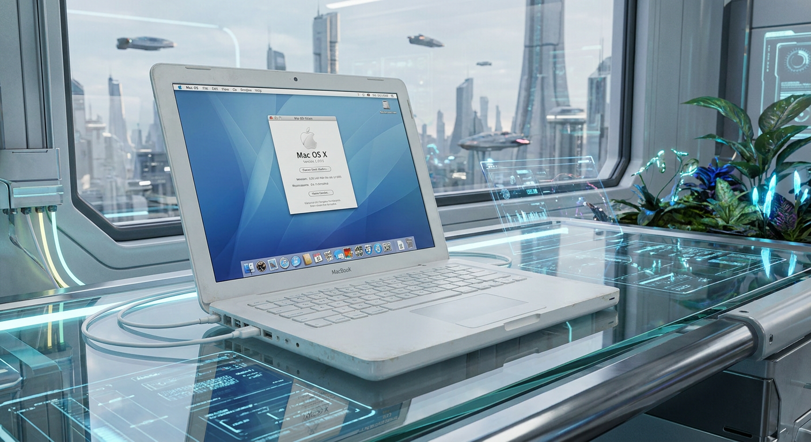

<div align="center">
  
</div>

<p align="center">
  <a href="README.md">Español</a> · <strong>English</strong>
</p>

---

# Debian 64-bit on MacBook2,1 with 32-bit EFI using Ventoy

A practical guide to installing **64-bit Debian GNU/Linux (`amd64`)** on an **Apple MacBook2,1** from 2006/2007, equipped with a 64-bit Intel Core 2 Duo processor but a **32-bit EFI firmware**.

This procedure uses **Ventoy** to create a USB drive capable of booting in **IA32 UEFI** mode and loading the standard Debian `amd64` image.

> [!IMPORTANT]
> This guide is based on an installation performed and tested on a **MacBook2,1**. Ventoy considers IA32 UEFI support experimental, so behavior may vary on other old Intel-based Apple computers.

---

## The problem

The MacBook2,1 has an unusual combination:

| Component | Architecture |
|---|---|
| Intel Core 2 Duo processor | 64-bit |
| Operating system it can run | 64-bit (`amd64`) |
| Mac EFI firmware | 32-bit (`IA32`) |

Because of this, a USB drive prepared in the usual way may not appear in the Mac startup manager or may fail before the installer starts.

Ventoy includes **IA32 UEFI** support and makes it possible to use a Debian `amd64` ISO without manually building a 32-bit EFI GRUB loader.

---

## Tested hardware

- Apple MacBook2,1.
- Intel Core 2 Duo processor.
- 32-bit EFI.
- USB 2.0 flash drive.
- Debian `amd64`.
- Ventoy.
- Xfce desktop.

> In this test, **Xfce worked correctly**. With **LXQt**, a login loop occurred. This is documented as the result of this specific installation and should not be interpreted as a general LXQt issue.

---

## Requirements

1. A MacBook2,1.
2. A USB flash drive. **USB 2.0** is recommended for this old hardware.
3. Another computer running:
   - Linux, or
   - Windows.
4. Ventoy.
5. An official Debian image for the `amd64` architecture.

### Downloads

- Ventoy: https://www.ventoy.net/en/download.html
- Debian: https://www.debian.org/download

For a network installation, you can use an image such as:

```text
debian-13.x.x-amd64-netinst.iso
```

The exact version will change as new Debian releases become available.

> [!NOTE]
> For this procedure, the standard **`amd64`** ISO is recommended. You do not need to use the `debian-mac-...-amd64-netinst.iso` image.

---

# Method 1: prepare the USB drive from Linux

## 1. Download Ventoy

Download the Linux version of Ventoy and extract it.

For example:

```bash
tar -xzf ventoy-x.x.xx-linux.tar.gz
cd ventoy-x.x.xx
```

---

## 2. Identify the USB drive

Connect the USB drive and run:

```bash
lsblk -d -e 7,11 -o NAME,SIZE,MODEL,TRAN
```

Example:

```text
NAME   SIZE MODEL             TRAN
sda    477G SSD
sdb   14.9G USB Flash Drive   usb
```

In this example, the USB drive is:

```text
/dev/sdb
```

> [!CAUTION]
> Carefully verify which device is the USB drive. Selecting the wrong disk can destroy data on another drive.

---

## 3. Install Ventoy on the USB drive

From the directory where Ventoy was extracted, run:

```bash
sudo ./Ventoy2Disk.sh -i /dev/sdX
```

Replace `/dev/sdX` with the correct device.

Example:

```bash
sudo ./Ventoy2Disk.sh -i /dev/sdb
```

Ventoy will ask for confirmation before modifying the drive.

> [!WARNING]
> A normal Ventoy installation formats the device and deletes its existing contents.

The command above uses the **MBR** partition scheme, which is Ventoy's default and the one used in this procedure.

---

## 4. Copy the Debian ISO

After Ventoy has been installed, disconnect and reconnect the USB drive if necessary.

A partition normally named:

```text
Ventoy
```

will appear.

Copy the Debian ISO directly into it:

```text
debian-13.x.x-amd64-netinst.iso
```

Do not extract the ISO and do not write it using `dd`.

Ventoy will detect the ISO file and display it in its boot menu.

---

# Method 2: prepare the USB drive from Windows

This method is easier because Ventoy provides a graphical interface.

## 1. Download Ventoy for Windows

Download:

```text
ventoy-x.x.xx-windows.zip
```

Extract it into a folder.

---

## 2. Run Ventoy

Inside the extracted folder, run:

```text
Ventoy2Disk.exe
```

It is recommended to use **Run as administrator**.

---

## 3. Select the USB drive

Under **Device**, carefully choose the USB drive that will be used to install Debian.

Keep the partition scheme set to **MBR**.

Click:

```text
Install
```

Ventoy will display warnings indicating that the USB drive contents will be erased.

Confirm only after verifying that the correct device is selected.

---

## 4. Copy Debian to the USB drive

When Ventoy finishes, Windows will show a new drive normally named:

```text
Ventoy
```

Open it in File Explorer and copy the ISO into it:

```text
debian-13.x.x-amd64-netinst.iso
```

That's all. You do not need Rufus, `dd`, Etcher, or to extract the ISO contents.

---

# Booting the MacBook2,1

## 1. Connect the USB drive

With the MacBook powered off, connect the Ventoy USB drive.

---

## 2. Open the Apple startup manager

Turn on the Mac and immediately hold:

```text
Option / Alt (⌥)
```

Keep holding it until Apple's startup manager appears.

The USB device should appear as a boot option.

Select it and press **Enter**.

---

## 3. Check that Ventoy started in IA32 mode

When the Ventoy menu appears, check the information displayed at the bottom of the screen.

On this Mac, the expected mode is:

```text
IA32
```

This means Ventoy has booted through the MacBook's 32-bit EFI firmware.

---

## 4. Select Debian

In the Ventoy menu, select:

```text
debian-13.x.x-amd64-netinst.iso
```

Press **Enter** and continue with the Debian installer.

Although the EFI firmware is 32-bit, the installed Debian system will be **64-bit (`amd64`)**, because the MacBook2,1 Core 2 Duo processor supports x86-64.

---

# Installing Debian

Once the installer starts, the procedure is almost the same as on any PC:

1. Select the language.
2. Configure the keyboard.
3. Configure the network.
4. Create a user and password.
5. Partition the disk according to the desired installation type.
6. Install the base system.
7. Install GRUB when requested by Debian.
8. Select the desktop environment.

This guide focuses on solving the specific problem of **booting a 64-bit Debian installer from a 32-bit EFI firmware**. Disk partitioning will depend on whether Debian will completely replace macOS or coexist with another operating system.

---

# Recommended desktop environment

For this hardware, the recommended desktop is:

```text
Xfce
```

It is relatively lightweight and worked correctly during the test installation.

During Debian's software selection step, choose **Xfce**.

In the test installation, LXQt entered a login loop, so Xfce was used instead.

---

# Verify that Debian was installed as 64-bit

After Debian starts, open a terminal and run:

```bash
dpkg --print-architecture
```

Expected output:

```text
amd64
```

You can also check the kernel architecture:

```bash
uname -m
```

Expected output:

```text
x86_64
```

To check whether the system booted using EFI:

```bash
if [ -d /sys/firmware/efi ]; then
    echo "System booted using EFI"
else
    echo "System booted without EFI"
fi
```

To check for 32-bit EFI GRUB packages:

```bash
dpkg -l | grep grub-efi-ia32
```

---

# Troubleshooting

## The USB drive does not appear when holding Option/Alt

Shut down the Mac completely, reconnect the USB drive, and repeat the boot process while holding:

```text
Option / Alt (⌥)
```

If it still does not appear, try a **USB 2.0** flash drive and another USB port.

You may also need to reset NVRAM/PRAM.

---

## Reset NVRAM / PRAM

Shut down the Mac.

Turn it on and hold the following keys simultaneously:

```text
Command (⌘) + Option (⌥) + P + R
```

Then try booting again with the USB drive connected.

---

## Reset the SMC

The MacBook2,1 normally uses a removable battery.

### Mac with removable battery

1. Shut down the Mac.
2. Disconnect the power adapter.
3. Remove the battery.
4. Hold the power button for approximately **5 seconds**.
5. Reinstall the battery.
6. Connect the power adapter.
7. Turn the Mac on normally.

If this guide is being applied to another Intel Mac with a non-removable battery, the SMC reset procedure may be different and should be verified for that specific model.

---

## Ventoy boots but Debian does not start

First check that:

- an `amd64` ISO was downloaded;
- the ISO was copied as a file to the Ventoy partition;
- Ventoy displays `IA32` as its boot mode;
- a recent Ventoy version is being used;
- the ISO is not corrupted.

The ISO checksum can be verified using the SHA checksum files published by Debian.

---

## Debian installer starts, but the installed system does not boot from the internal disk

The current Debian installer supports systems with a 64-bit CPU and 32-bit UEFI firmware and can install the appropriate EFI GRUB variant.

If a problem occurs, boot again from the Ventoy USB drive and use Debian rescue mode to inspect the EFI System Partition and the GRUB installation.

---

# Why this works

The MacBook2,1 uses a 64-bit processor, but Apple equipped this model with 32-bit EFI firmware.

The limitation is not the processor's ability to run 64-bit Debian. The problem is the first stage of the boot process.

Conceptually, the boot chain is:

```text
MacBook2,1
    │
    ├── 32-bit Apple EFI
    │
    ▼
Ventoy IA32 UEFI
    │
    ▼
Debian amd64 installer
    │
    ▼
64-bit Debian GNU/Linux
```

Ventoy acts as a bridge between the Mac's IA32 firmware and the Debian `amd64` installer.

---

# References

- Ventoy - Getting Started: https://www.ventoy.net/en/doc_start.html
- Ventoy - IA32 UEFI Support: https://www.ventoy.net/en/doc_ia32.html
- Debian - Download Debian: https://www.debian.org/download
- Debian Wiki - UEFI: https://wiki.debian.org/UEFI
- Debian Wiki - Installing Debian on MacBook2,1: https://wiki.debian.org/InstallingDebianOn/Apple/MacBook/2-1
- Apple - Startup key combinations: https://support.apple.com/102603

---

# Result

The final goal is:

```text
Apple MacBook2,1
x86-64 CPU
32-bit IA32 EFI
64-bit Debian amd64
Xfce
```

without manually modifying a Debian ISO or manually building a 32-bit EFI GRUB loader for the installation USB drive.

---

## License

This procedure may be freely used, modified, and shared for educational and technical purposes.

If you find improvements or differences when following this procedure on another Intel Mac with 32-bit EFI, you can document them through an *issue* or *pull request*.
